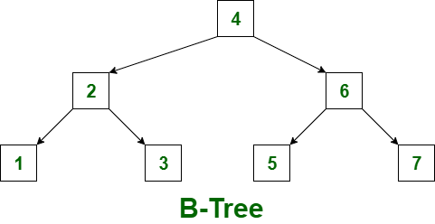

### 데이터베이스 종류

데이터베이스는 크게 RDBMS, NoSQL 두 가지의 종류로 나뉘게 된다. 이 둘의 큰 차이는 데이터베이스의 각 테이블이 서로 관계를 가지고 있는지와 쿼리문을 사용할 수 있는지가 있다.

* 관계형 데이터베이스(RDBMS, Relational Database Management System)

    관계형 데이터베이스는 각 테이블이 행과 열을 가지는 표 형식 데이터를 저장하는 형태를 가지며 SQL이라는 언어를 사용한다. MySQL, PostgreSQL, 오라클 등이 있다.

* NoSQL(Not only SQL)

    NoSQL은 SQL언어를 사용하는 관계형 데이터베이스를 제외한 모든 데이터베이스를 말한다. 대표적으로 MongoDB, redis 등이 있다.

### 인덱스(index)

인덱스는 데이터베이스가 데이터를 빠르게 찾도록 돕는 장치이다. 우리가 책을 볼때 특정 단어가 책의 어느 페이지에서 나오는지 찾기위해 책의 맨 뒤 페이지를 보면 나오는 색인과 같은 것이다.

인덱스는 보통 B-Tree(Binary Tree)라 불리는 자료구조로 이루어져 있다.

위는 아주 간단한 구조를 가진 B-Tree이다. 보통 "~보다 큰", "~보다 작은"의 조건으로 리프 노드까지 찾아가면 리프 노드가 데이터 포인터를 가지고 있어 해당 포인터를 통해 데이터를 찾게 된다.

인덱스가 있으면 읽기 쿼리문의 수행 능력이 비약적으로 상승할 수 있다. 하지만 인덱스는 계속해서 정렬은 해주어야하기 때문에 추가, 수정, 삭제 쿼리문의 경우 속도가 매우 느려질 수 있다. 결론적으로 인덱스는 저장성능을 희생하면서 읽기성능을 비약적으로 상승시키는 장치이다. 만들려는 서비스의 데이터베이스에 따라 많은 생각을 하며 인덱스를 구축해야 한다.

### 조인(Join)

조인이란 두 개 이상의 테이블을 묶어서 하나의 결과물을 만드는 것을 말한다.

* 조인의 종류

    

    + 내부 조인(inner join): 각 테이블의 행이 일치하는 부분만 표기한다.
    + 왼쪽 조인(left join): 왼쪽 테이블의 모든 행을 표기한다.
    + 오른쪽 조인(right join): 오른쪽 테이블의 모든 행을 표기한다.
    + 합집합 조인(full join): 두 테이블의 모든 행을 표기한다.
 