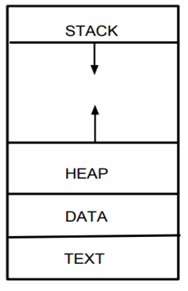

프로세스는 컴퓨터상에서 실행되고 있는 프로그램을 말하며, 스레드는 프로세스 내의 작업 흐름을 의미한다.

### 프로세스의 메모리 구조

운영체제는 프로세스에 적절한 메모리를 할당하는데 다음 구조를 기반으로 할당한다.

위에서부터 스택, 힙, 데이터 영역, 코드 영역으로 나뉜다. 스택은 위 주소부터 할당되고 힙은 아래 주소부터 할당된다.

* 스택

    스택에는 지역변수, 매개변수, 함수가 저장되고 컴파일 시 크기가 결정되며 동적인 특징을 갖는다.

    스택 영역은 함수가 함수를 재귀적으로 호출하면서 동적으로 크기가 늘어날 수 있는데, 이때 힙과 스택의 메모리 영역이 겹치면 안 되기 때문에 힙과 스택 사이의 공간을 비워 놓는다.

* 힙

    힙은 동적 할당 시 사용되며 런타임 시 크기가 결정된다. 예를 들어 벡터 같은 동적배열은 당연히 힙에 동적 할당된다. 힙은 동적인 특징을 갖는다.

* 데이터 영역

    데이터 영역은 전역변수, 정적변수가 저장되고, 정적인 특징을 갖는 프로그램이 종료되면 사라지는 변수가 들어 있는 영역이다.

    데이터 영역은 BSS 영역과 Data 영역으로 나뉜다. BSS 영역은 초기화가 되지 않은 변수가 0으로 초기화 되어 저장되며 Data 영역은 0이 아닌 다른 값으로 할당된 변수들이 저장된다.

* 코드 영역

    코드 영역은 프로그램에 내장되어 있는 소스 코드가 들어가는 영역이다. 이 영역은 수정 불가능한 기계어로 저장되어 있으며 정적인 특징을 가진다.

### PCB(Process Control Block)

운영체제에서 프로세스에 대한 메타데이터를 저장한 데이터를 말한다. 프로세스가 생성되면 운영체제는 해당 PCB를 생성한다.

* PCB의 구조

    + 프로세스 스케쥴링 상태: '준비', '일시중단' 등 프로세스가 CPU에 대한 소유권을 얻은 이후의 상태
    + 프로세스 ID: 프로세스 ID, 해당 프로세스의 자식 프로세스 ID
    + 프로세스 권한: 컴퓨터 자원 또는 I/O 디바이스에 대한 정보
    + 프로그램 카운터: 프로세스에서 실행해야 할 다음 명령어의 주소에 대한 포인터
    + CPU 레지스터: 프로세스를 실행하기 위해 저장해야 할 레지스터에 대한 정보
    + CPU 스케쥴링 정보: CPU 스케쥴러에 의해 중단된 시간 등에 대한 정보
    + 계정 정보: 프로세스 실행에 사용된 CPU 사용량, 실행한 유저의 정보
    + I/O 상태 정보: 프로세스에 할당된 I/O 디바이스 목록

### 컨텍스트 스위칭(Context switching)

PCB를 교환하는 과정을 말한다. 한 프로세스에 할당된 시간이 끝나거나 인터럽트에 의해 발생한다. 컴퓨터는 많은 프로그램을 동시에 실행하는 것처럼 보이지만 어떠한 시점에서 실행되고 있는 프로세스는 단 한개이며, 많은 프로세스가 동시에 구동되는 것처럼 보이는 것은 다른 프로세스와의 컨텍스트 스위칭이 아주 빠른 속도로 실행되기 때문이다.

사실 현대 컴퓨터는 멀티코어의 CPU를 가지고 있기에 프로세스가 단 한개만 실행된다는 설명은 사실이 아니지만, 컨텍스트 스위칭을 설명할 때는 싱글코어 기준으로 설명한다.

* 캐시미스

    컨텍스트 스위칭이 일어날 때 프로세스가 가지고 있는 메모리 주소가 그대로 있으면 잘못된 주소 변환이 생기므로 캐시클리어 과정을 겪게 되고 이 때문에 캐시미스가 발생한다.

* 스레드에서 컨텍스트 스위칭

    스레드는 프로세스 내에서 스택 영역을 제외한 부분을 스레드끼리 공유하므로 프로세스의 컨텍스트 스위칭에 비해 비용이 더 적게 든다.

### 멀티 프로세스와 스레드

멀티 프로세스는 여러 개의 프로세스가 동시에 두 가지 이상의 일을 병렬적으로 수행하는 것을 말한다. 특정 프로세스의 메모리, 프로세스 중 일부에 문제가 발생되더라도 다른 프로세스를 이용해서 처리할 수 있어 신뢰성이 높다.

스레드는 프로세스와 달리 스택 이외의 영역을 서로 공유하기에 멀티 스레드 작업 시 자원 소모가 작다는 장점이 있지만, 한 스레드에 문제가 생기면 다른 스레드에도 영향을 끼친다는 단점이 존재한다.

### 공유 자원과 임계 영역

공유 자원은 시스템 안에서 각 프로세스, 스레드가 함께 접근할 수 있는 모니터, 프린터, 메모리, 파일, 데이터 등의 자원이나 변수 등을 의미한다. 이 공유 자원을 두 개이상의 프로세스가 동시에 읽거나 쓰는 상황을 경쟁 상태(race condition)라고 한다. 동시에 접근을 시도할 때 접근의 타이밍이나 순서 등이 결과값에 영향을 줄 수 있다.

공유 자원에 접근할 때 순서 등의 이유로 결과가 달라지는 영역을 임계 영역(critical section)이라고 한다. 임계 영역을 해결하기 위한 방법으로 뮤텍스, 세마포어, 모니터가 있으며, 이 방법 모두 상호 배제, 한정 대기, 융통성이란 조건을 만족한다. 이 방법의 토대가 되는 개념은 락(lock)이다.

* 상호 배제

    한 프로세스가 임계 영역에 들어갔을 때 다른 프로세스는 접근할 수 없다.

* 한정 대기

    특정 프로세스가 영원히 임계 영역에 들어가지 못하면 안된다.

* 융통성

    한 프로세스가 다른 프로세스의 일을 방해해선 안된다.

#### 뮤텍스와 세마포어

뮤텍스는 공유 자원을 사용하기 전에 잠금을 설정하고 사용한 후에 헤제하는 방법이다. 잠금이 설정되면 다른 프로세스 및 스레드는 접근할 수 없다. 또한 뮤텍스는 하나의 락만 소유한다.

세마포어는 간단한 정수값과 두 가지 함수 wait 및 signal로 공유 자원에 대한 접근을 처리한다. wait()는 자신의 차례가 올 때까지 기다리는 함수, signal()은 다음 프로세스로 순서를 넘겨주는 함수이다. 프로세스가 공유 자원에 접근하면 세마포어에서 wait() 작업을 수행하고 프로세스가 공유 자원을 헤제하면 세마포어에서 signal() 작업을 수행한다. 세마포어에는 조건 변수가 없고 프로세스가 세마포어 값을 수정할 때 다른 프로세스는 동시에 세마포어 값을 수정할 수 없습니다.

* 바이너리 세마포어

    0과 1 두 가지 값만 가질 수 잇는 세마포어이다. 구현의 유사성으로 인해 뮤텍스는 바이너리 세마포어라고 할 수도 있다. 하지만 엄밀히 말하면 뮤텍스는 리소스에 대한 접근을 동기화하는 데 사용되는 메카니즘이고, 세마포어는 신호를 기반으로 상호 배제가 일어나는 신호 메커니즘이다.

* 카운팅 세마포어

    여러 개의 값을 가질 수 있는 세마포어이며, 여러 자원에 대한 접근을 제어하는 데 사용된다.

* 모니터

    둘 이상의 스레드나 프로세스가 공유 자원에 안전하게 접근할 수 있도록 공유 자원을 숨기고 해당 접근에 대해 인터페이스만 제공한다.

### 교착 상태

두 개이상의 프로세스들이 서로가 가진 자원을 기다리며 중단된 상태를 말한다. 원인으로 상호 배제, 점유 대기, 비선점, 환형 대기가 있다.

* 비선점

    다른 프로세스의 자원을 강제로 가져올 수 없다

* 환형 대기

    프로세스 A는 프로세스 B의 자원을 요구하고, 프로세스 B는 프로세스 A의 자원을 요구하는 등 서로의 자원을 요구하는 상활을 말한다.

#### 교착 상태 해결방법

1. 자원을 할당할 때 애초에 조건이 성립되지 않도록 설계한다.
2. 교착 상태 가능성이 없을 때만 자원이 할당되며, 프로세스당 요청할 자원들의 최대치를 통해 자원 할당가능 여부를 파악하는 '은행원 알고리즘'을 사용한다.
3. 교착 상태가 발생하면 사이클이 있는지 찾아보고 이에 관련된 프로세스를 한개 씩 지운다.
4. 교착 상태는 자체가 매우 드물게 발생하고, 처리하는 비용이 많이 소모된다. 그래서 교착 상태가 발생하면 사용자는 작업을 종료시켜버린다.

* 은행원 알고리즘

    총 자원의 양과 할당한 자원의 양을 기준으로 안정 또는 불안정 상태로 나누고 안정 상태로 가도록 자원을 할당하는 알고리즘